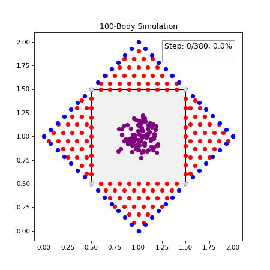

# Snowflake ❄️

By Noah Marquie as part of the UBC Mathematics Anthony Wachs Research Group.

2D and 3D point-cloud generation for complex meshes using physics-informed particle simulations. 

## Overview

This repository is a package to create 2D point clouds to fill in arbitrary polygons using physics-informed particle simulations. Additionally, this package includes 'extrude' functionality to extend point clouds in 3D, making hollow shells.

## Tech Stack

- Language: Python 3.12
- Key Libraries: SciPy, JAX, NumPy, Matplotlib, Shapely
- Tools: Docker (Soon), Git (GitHub)

